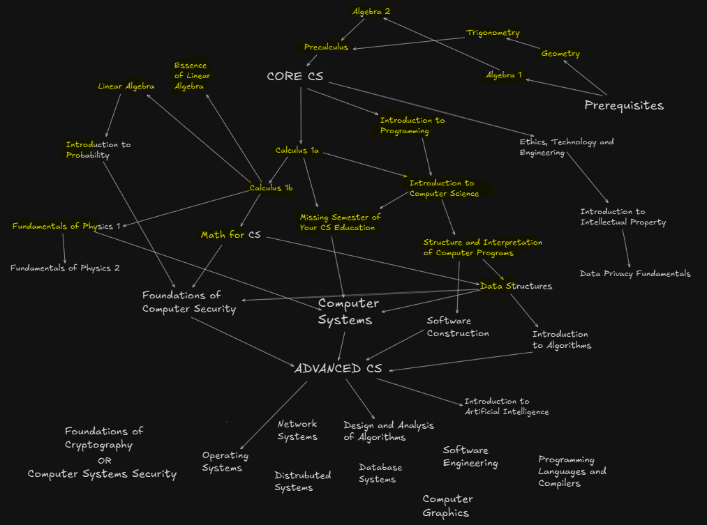

## Table of Contents
1. [About](#about)
2. [Curriculum Overview](https://github.com/ossu/computer-science/blob/master/CURRICULAR_GUIDELINES.md)
3. Modules
   - [Khan Academy](#khan-academy)
   - [Intro CS](#intro-cs)
   - [Core CS](#core-cs)
   - [Advanced CS](#advanced-cs)
   - [Electives](#electives)
4. [Resources](#resources)
5. [Log by date](#log)
6. [Current schedule](#schedule)
7. [Current graph version of the progress](#graph)
8. [Support](#support)

## About
I will be sharing the courses taken to track and document my progress. This is a comprehensive computer science curriculum using resources from [Open Source Society University](#ossu) which is aligned with the standards outlined in [CS2013 Curriculum Guidelines for Undergraduate Degree Programs in Computer Science](https://github.com/ossu/computer-science/blob/master/CURRICULAR_GUIDELINES.md).

## Khan Academy
[Return to table of contents](#table-of-contents)
#### Prerequisites

_Topics Covered_:
`high school geometry`
`college algebra`
`trigonometry`
`precalculus`
| Course | Progress | Start Date | Planned End Date | Actual End Date | Proof |Projects| Notes |
:-- | :--: | :--: | :--: | :--:|:--:|:--:|:--:|
|Algebra 1 | | - |10.02.23|10.02.23|[alg1](./prerequisites/) |-|[Google Docs](https://docs.google.com/document/d/1BJkhLWKtQVTutCbBOL5Am8IlfLq9bDqoBrA2aGlQ7eo/edit?usp=sharing)|
|Geometry | | - |26.10.23|26.10.23|[geo](./prerequisites/) |-|[Google Docs](https://docs.google.com/document/d/1n7f1E6zxKXha6v5mLx7cQehJuKmo-on3UmyP_uOSCYI/edit?usp=sharing)|
|Algebra 2 | |- |15.01.24|15.01.24|[alg2](./prerequisites/) |-|[Google Docs](https://docs.google.com/document/d/1ma1xHGy0dGXNuQbXPrLDidT_F8d6hQ4QrPBRRmm-hyA/edit?usp=sharing)|
|Trigonometry | |-|04.02.24|04.02.24|[trig](./prerequisites/) |-|[Google Docs](https://docs.google.com/document/d/1n7f1E6zxKXha6v5mLx7cQehJuKmo-on3UmyP_uOSCYI/edit?usp=sharing)|
|Precalculus | | 21.02.24 |11.04.24|08.04.24|[precalc](./prerequisites/) |-|[Google Docs](https://docs.google.com/document/d/1PSfIDMT3UEdDhIJkCUgGjDmI9NO2-VB8JhcVCIdnaJ8/edit?usp=sharing)|

## OSSU

### INTRO CS
[Return to table of contents](#table-of-contents)
#### Introduction to Programming and Computer Science

_Topics Covered_:
`simple programs`
`simple data structures`
`computation`
`imperative programming`
`basic abstractions`
`basic data structures and algorithms`
`and more`
| Course | Progress | Start Date | Planned End Date |Actual End Date| Proof |Projects| Notes |
:-- | :--: | :--: | :--: | :--:|:--:|:--:|:--:|
|Introduction to Programming| | 04.03.24 |08.04.24|17.03.24|[cs50p](./intro-cs/intro-to-programming/cs50p/) |-|[Google Docs](https://docs.google.com/document/d/1W2IWr0ZsR0zi2xMu8_otMD-uPK5WGmOiPZjDeM9zeJU/edit?usp=sharing)|

| Course | Progress | Start Date | Planned End Date |Actual End Date| Proof |Projects| Notes |
:-- | :--: | :--: | :--: | :--:|:--:|:--:|:--:|
|Introduction to Computer Science | | 22.03.24 |25.05.24|02.07.24|[mit 6.0001](./intro-cs/intro-to-computer-science/MIT-6.0001/) |-|[Google Docs](https://docs.google.com/document/d/1SEqocEuG1JfpeHpxPkkRKuUvD8_yLBg1HBKsEq8jwOE/edit?usp=sharing)|

### CORE CS
[Return to table of contents](#table-of-contents)
#### Core programming

**Topics covered**:
`functional programming`
`design for testing`
`program requirements`
`common design patterns`
`unit testing`
`object-oriented design`
`static typing`
`dynamic typing`
`ML-family languages (via Standard ML)`
`Lisp-family languages (via Racket, Scheme)`
`Ruby`
`and more`
| Course | Progress | Start Date | Planned End Date |Actual End Date| Proof |Projects| Notes |
:-- | :--: | :--: | :--: | :--:|:--:|:--:|:--:|
|Structure And Interpretation Of Computer Programs| | 02.07.24 |17.10.24|10.12.24|[cs61a](./core-cs/core-programming/sicp/) |[projects](./core-cs/core-programming/sicp/projects)|[Google Docs](https://docs.google.com/document/d/1ge1JjM2ER7VkYoT3uk8Wp_-HZ2bAJwh-QjD7YnkYW6o/edit?usp=sharing)|

#### Core theory 

**Topics covered**:
`heap, stack, queue`
`linked lists`
`hash table`
`trees`
`etc`
| Course | Progress | Start Date | Planned End Date |Actual End Date| Proof |Projects| Notes |
:-- | :--: | :--: | :--: | :--:|:--:|:--:|:--:|
|Data Structures| |10.12.24|10.03.25|08.06.2025|[cs61b](./core-cs/core-theory/data-structures/) |[projects](./core-cs/core-theory/data-structures/projects)|[Google Docs](https://docs.google.com/document/d/1h--IlxzWrA8k8R8Ls-Ikoxhdb89BJmBbhq7kM195IwQ/edit?usp=sharing)|

#### Core math

**Topics covered**:
`discrete mathematics`
`mathematical proofs`
`basic statistics`
`O-notation`
`discrete probability`
`and more`
| Course | Progress | Start Date | Planned End Date |Actual End Date| Proof |Projects| Notes |
:-- | :--: | :--: | :--: | :--:|:--:|:--:|:--:|
|Differential Calculus || 15.04.24 |30.07.24|14.10.24|[mit-18-01-1x](./core-cs/core-math/differential-calc/) |-|[Google Docs](https://docs.google.com/document/d/1FYjFgYpoVLQwJ2md586ooVq8QMzG37PVtqgQPQOuIDs/edit?usp=sharing)|
|Integral Calculus || 14.10.24 |22.01.25|22.03.25|[khan-academy](./core-cs/core-math/integral-calc/) |-|[Google Docs](https://docs.google.com/document/d/1FYjFgYpoVLQwJ2md586ooVq8QMzG37PVtqgQPQOuIDs/edit?usp=sharing)|
|Math for CS|| 15.11.24 |22.02.25|06.08.25|[math-for-cs](./core-cs/core-math/math-for-cs/) |-|[Google Docs](https://docs.google.com/document/d/11hfZRsWbpXcznnR1YBaEDd_9QlX1nCK0m2taCPZZg7g/edit?usp=sharing)|

#### CS Tools

**Topics covered**:
`terminals and shell scripting`
`vim`
`command line environments`
`version control`
`and more`
| Course | Progress | Start Date | Planned End Date |Actual End Date| Proof |Projects| Notes |
:-- | :--: | :--: | :--: | :--:|:--:|:--:|:--:|
|The Missing Semester | | 22.06.24 |22.07.24|15.11.24|[mit-missing](./core-cs/core-tools/mit-missing) |-|[Google Docs](https://docs.google.com/document/d/1jrVr1e5MFEhYxtQ7pT5dFxz6ExrojlgzKy-8xUpES0c/edit?usp=sharing)|

### ADVANCED CS
[Return to table of contents](#table-of-contents)
#### Advanced math

**Topics covered**:
`vectors and vector space`
`matrices`
`linear independence`
`dimensions`
`and more`
| Course | Progress | Start Date | Planned End Date |Actual End Date| Proof |Projects| Notes |
:-- | :--: | :--: | :--: | :--:|:--:|:--:|:--:|
|Linear Algebra || 14.10.24 |22.01.25|27.02.25|[mit18.06sc](./advanced-cs/advanced-math/linear-algebra/) |[projects](./advanced-cs/advanced-math/linear-algebra/spinningCube)|[Google Docs](https://docs.google.com/document/d/1ieGaWKd6_c_jAStE7_Xhg6oUc5kr_CYZ34NqOsLDX_E/edit?usp=sharing)|

| Course | Progress | Start Date | Planned End Date |Actual End Date| Proof |Projects| Notes |
:-- | :--: | :--: | :--: | :--:|:--:|:--:|:--:|
|Introduction to Probability|| 01.03.25 |1.07.25||[stat-110](./advanced-cs/advanced-math/introduction-to-probability/) |[projects]()|[Google Docs](https://docs.google.com/document/d/1xdIrMa2W9hERx3B4T_JcIlJTP8JhwLjJM8Cf6XFpNbk/edit?usp=sharing)|

### ELECTIVES
[Return to table of contents](#table-of-contents)
#### Physics 

**Topics covered**:
`vectors`
`1d, 2d motion`
`newton's laws`
`and more`
| Course | Progress | Start Date | Planned End Date |Actual End Date| Proof |Projects| Notes |
:-- | :--: | :--: | :--: | :--:|:--:|:--:|:--:|
|Fundamentals of Physics 1|| 21.01.25 |21.04.25|-|[physics-200](./electives/fundamentals-of-physics-1) |-|[Google Docs](https://docs.google.com/document/d/1BGAQ1cP0Zwlo8SO5Iy_2JAIe07Z8h8OdzgHwNgVWnwA/edit?usp=sharing)|

## Log
[Return to table of contents](#table-of-contents) 
[Move to HEAD](#head)
### TAIL

- Khan Academy Algebra 1 completed.

### 20/03/2023

- Khan Academy High School Geometry in progress.
- Topics:
  - Rotating shapes
  - Congruence

### 06/07/2023

- Learned that triangle inner angles sum to 180 degrees.

### 31/07/2023

- Topics:
  - Similarity
  - Pythagorean theorem proof using similarity and two areas.

### 19/08/2023

- Learned about Trigonometric ratios.

### 29/08/2023

- Studied Analytic geometry.

### 17/09/2023

- Covered Conic sections.

### 25/09/2023

- Expanded equations of a circle.

### 28/09/2023

- Delved into Circles.

### 20/10/2023

- Exploring Solid Geometry.

### 21/10/2023

- High School Geometry concurrently with Algebra 2
- Average rate of change.

### 26/10/2023

- High School Geometry done :)
- Trigonometry concurently with Algebra 2
- Complex numbers
- Polynomial arithmetic

### 27/10/2023

- Polynomial factorization

### 08/11/2023

- Polynomial Division done;
- new unit Polynomial graphs

### 17/11/2023

- Polynomial graphs done;
- Rational exponents done;

### 19/11/2023

- Exponential models;

### 30/11/2023

- Trigonometric functions done;

### 11/12/2023

- Algebra 2: Exponential Models done; Logarithms done ; New unit transformation of functions
- Trigonometry: new unit Non right triangles trigonometry

### 11/12/2023

- Transformations of functions done; new unit equations

### 27/12/2023

- quadratic, cubic equations and system equations, graphs done

### 28/12/2023

- modeling with function combinations

### 09/01/2024

- modeling done

### 15/01/2024

- Algebra 2 done

### 21/01/2024

- Trigonometry non right triangles; sine law, sine law proof, cosine law, cosine law proof done;

### 04/02/2024 Achieved First Milestone 🎉

- Completed Algebra 1, Algebra 2, High School Geometry, and Trigonometry courses – prerequisites for OSSU. Ready for the next challenge.

### 06/02/2024

- Python for Everybody - OSSU, Pre Calculus - Khan Academy

### 13/02/2024

- Python for Everybody - loops iterations; Pre Calculus - complex numbers

### 19/02/2024

- Python for Everybody - dictionares; Pre Calculus - dividing multiplying complex numbers

### 21/02/2024

- Pre Calculus - rational functions

### 25/02/2024

- Pre Calculus - rational word problems, PY4E done, 12 units out of 17, because others are optional so looking forward for CS50P :rocket:

### 26/02/2024

- CS50P unit 0 functions

### 27/02/2024

- CS50P unit 0 done

### 27/02/2024

- rational functions done, starting conic sections

### 05/03/2024

- precalculus conic sections 55%, cs50p 4 unit done - exceptions

### 06/03/2024

- precalculus conic sections done, cs50p 5 unit in progress

### 08/03/2024

- precalculus vectors, cs50p 5 unit done - libraries, unit 6 - in progress

### 10/03/2024

- precalculus vectors, cs50p unit 6 unit tests - done

### 15/03/2024

- precalculus matrixes, cs50p skipped the i/o unit moved to the regexp unit done about 50%
- school physics, unit 1, one dimensional motion

### 17/03/2024

- cs50p done; besides unit 6 and 8, they were irrelevant for me.

### 22/03/2024

- dropped khan academy high school physics, seems useless without calculus..

### 27/03/2024

- mit 6.0001 week 1 in progress, ps1 released
- khan academy precalculus matrices done, starting probability and combinatorics unit

### 03/04/2024

- mit 6.0001 week 2 in progress, ps1 done
- precalculus probability and combinatorics in progress

### 08/04/2024

- mit 6.0001, problem set 2 in progress, week 3 in progress
- precalculus probability and combinatorics done, precalc done
- mit's single variable calculus program began

### 11/04/2024

- mit 6.0001 problem set 2 50% done, week 3 reading/lectures
- changed mit single variable calculus estimation from 13 weeks to around 26 weeks, it includes calc 1a 1b and 1c combined together

### 13/04/2024

- mit 6.0001 problem set 2 75% done , week 3 reading 75% done/ lectures need to watch
- calculus week 1 in progress, getting hands on derivatives today

### 15/04/2024

- dropping single variable calculus 18.01, way to fast paced, and too hard for me.
- starting calculus mit 18.01 1a differentiation

### 17/04/2024

- mit 18.01.1x calc 1a unit 0 limits
- mit 6.0001 ps2 80% done, ps3 in progress, reading in progress

### 18/04/2024

- mit 18.01.1x calc 1a limits
- mit 6.0001 ps2 finally done

### 23/04/2024

- mit 18.01.1x calc 1a Continuity/Discontinuity, IVT
- mit 6.0001 ps3 in progress

### 29/04/2024

- mit 18.01.1x calc 1a unit 1 Derivates
- mit 6.0001 ps3 4/6 done

### 3/05/2024

- mit 6.0001 ps3 done

### 9/05/2024

- mit 6.0001 ps3 update, reading next chapters, mit 18.01.1x midterm1, exercises, higher order derivatives

### 17/05/2024

- mit 6.0001 ps4 in progress, mit 18.01.1x unit 1 almost done, unit 2 in progress soon

### 26/05/2024

- mit 6.0001 ps4-a done, mit 18.01.1x

### 27/05/2024

- mit 6.0001 ps4-b in progress, mit 18.01.1x unit 2 differentiation in progress

### 10/06/2024

- mit 6.0001 ps4 done

### 16/06/2024

- mit 18.01.1x product rule done

### 22/06/2024

- mit 18.01.1x quotient rule done, chain rule in progress
- the missing semester at mit week 1, lecture 1, the shell
- mit 6.0001 reading on big o done, lectures done, ps5 in progress

### 26/06/2024

- mit missing semester lesson 2, hw 2 in progress 

### 02/07/2024
- mit 6.0001 done
- mit 18.01.1x chain rule done  

### 06/07/2024
- mit 18.01.1x implicit explicit differentiation
- cs61a sicp week1 hw ready, lab in progress 

### 15/07/2024
- mit 18.01.1x inverse functions almost done
- cs61a sicp week2 hw in progress

### 27/07/2024
- mit 18.01.1x derivate a log or exponential function
- mit missing semester lesson 2, hw 2 done
- cs61a week2 hw done, week 3 lessons and reading in progress 

### 29/07/2024
- cs61a sicp week3, reading, project 1 in progress

### 5/08/2024
- calc 1a unit 2 differentiation done, moving to unit 3 approximations

### 5/08/2024
- сalc 1a unit 3 approximation - dropped linear approximation(useless), moved to quadratic approximations
  update(I am dropping mit calculus 1a unit 3 and unit 4 in favour of Khan Academy's unit 4, 5, 6 in differential calculus)
  so
- calculus 1a ka unit 4 applications of derivatives, meaning of the derivatives in context

### 25/08/2024
- calc 1a unit4 applications 30% done 
- cs61a/sicp week 3 project/hw done(to be honest that was hard)
- dropping missing-semester homework 3(vim), I feel that I don't need it at the moment, I know some basics, that's it.
- missing semester lecture 4(data wrangling) in progress 

### 02/09/2024
- calc 1a unit4 still in progress 
- cs61a week 4 reading/lectures done, notes analysing done

### 06/09/2024
- cs61a week 4 done, week 5 in progress

### 18/09/2024
- cs61a week 5 reading/lectures(partially done), example interpreter in progress
- calc 1a unit 4 applications of derivatives done, unit 5 analyzing functions in progress
- missing semester hw4 ex2 in progress

### 06/10/2024
- cs61a week 5 homework 90% done
- calc 1a unit 5 around 80% done
- missing semester homework 4, 4/5 done

### 07/10/2024
- cs61a dropping project 2, moving to week 6
- calc 1a analysing functions 90% done

### 08/10/2024
- sicp/cs61a week 6 reading/lectures
- calc 1a optimization problems and unit 6 parametric equations, polar coordinates vector functions

### 08/10/2024
- sicp week 6: labs 
- integral calc unit 1: integrals
- linear algebra unit 1: part 1/13

### 24/10/2024
- sicp week 6: labs done, homework in progress 
- integral calc unit 1: integrals in progress
- linear algebra homework 1, a few exercises, unit 3-4

### 27/10/2024
- linear algebra, week-1 homework done
- mit missing, cli, git lectures done; reading pro-git on the side 
- mit missing debugging and profiling in progress 

### 28/10/2024
- sicp week 6 done, week 7 in progress

### 31/10/2024
- sicp dropped week 7(because oop was already in 6.0001), moving into week 8
- linear algebra problem set 2 in progress
- calc-1b integral quizz 4 in progress soon

### 8/11/2024
- sicp week 9 - mutable data
- linear algebra problem set 3
- missing semester - hw9
- starting math-for-cs

### 15/11/2024
- sicp week 10 - client/server programming
- missing semester - done

### 16/11/2024
- calc-1b unit 2 out of 5, diff equations next..

### 9/12/2024
- I am done with CS61A, dropped weeks 12-15, because of redundancy and irrelevancy
  it's outdated and makes no sense for me to continue, moving forward.

### 10/12/2024
- CS61B data structures week1 in progress

### 17/12/2024
- CS61B hw1/lab1 done, next lectures in progress, looking forward for hw2/lab2 and project1
- Linear Algebra unit 2 out of 3, lessons 1 out of 11, hw 5 in progress 
- Math for CS hw 3 in progress…

### 20/12/2024
- CS61B lab2 done; I was supposed to write it in EMACS

### 31/12/2024
Another year came to an end, this is a long run for me, I am in my second year at OSSU, I need another year and a little more to get done all the courses needed, for all who will read this, continue to stay motivated, enjoy cs, enjoy programming, keep pushing. Happy New Year🎉🎆✨

- calc 1b 3/5 of the course done, my favourite, Sal Khan is a brilliant tutor.
- math for cs 1/3 of the course done, don't like the explanations, superficial.
- linear algebra 1/2 of the course done, got a little lost at projection matrices.
- cs61b data structures around 1/10 done, everything on point.

### 22/01/2025
I am not sure how I will go with the fundamentals of physics, if it's going to be too hard I'll drop out. 
- Data Structures hw2 done, looking forward to lab3 hw3 and project1.
- Fundamentals of Physics week1 in progress, Newtonian mechanics, vectors.
- Calculus 1b applications of integrals, with volumes.
- Math for cs structures unit 2 out of 4 units, gcd.
- Linear Algebra, determinant week and all about it.

### 24/01/2025
- I took another elective to fulfill a part of the english composition and writing, it's free, why not.
- Linear Algebra almost done with unit 2 out of 3, eigenvalues, eigenvectors, a little useless for me, too mathy, but have to carry it.
- Calculus 1b, finising applications of integrals.
- Data Structures, slinked lists lab3 done.
- Math for CS, GCD.
- Physics still week1 out of week12, plan to tackle homework this weekend.

### 27/01/2025
- fundamentals of physics - week2 lessons, pset1-problem1, problem2.
- calculus 1b - applications of integrals done, arclen, around 80% of the course done, I don't consider parametric equations because it's a small unit.
- english composition - module1, part of hw1.
- data structures, picture for linked list, and project1 in progress

### 04/02/2025
- fundamentals of physics - week3 lessons, pset2-problem1, problem2.
- calculus 1b - last unit.
- english composition - module2.
- data structures, hw3, project 1 stil pending.
- linear algebra: dropping the course, its irrelevant, after unit I and unit II and 2/3 I needed transfomations but there arent any, instead of it, I will do my final project which is a spinning cube in c++ and sfml or sdl, to compensate the drop, project init.
- math for cs -  ps5 only gcd and congruence were good, the rest are irrelevant, moving forward to ps6.

### 09/02/2025
- fundamentals of physics - week4, pset2 done, starting pset3 for the next week; its hard, I cannot solve almost anything without examples or hints, but the general concepts I do understand, the only problem is with algorithm design and the strategy design, what is what, which is the hardest part, but in general, I need it more in the theoretical way so, see no problem, I still understand it.
- data structures, hw3 done, I'll try to move faster with this, too much time, had some bugs with vscode cache and java packages,
my hw3 was importing classes from lab3 instead of current hw3 folder, It was hard for me to fix that besides the homework itself, which was ok.
- calc 1b final unit - series; I started to enjoy calculus, in physics I get more practice with it.
- linear algebra cube project is in progress, I barely started, I know 0 c++, but will get there

In general, this versatility of programming languages, libraries, sometimes annoys me, but this skill should be good for the future self.

### 11/02/2025
- solved one physics problem with the help of my gpt-ta, it was helpful, I got an understanding, pleased with the result, I was thinking all the way in steps, and used the understanding -> goal -> strategy -> implimentation -> evaluation, problem solving technique
- cube project: init project, window, renderer, poll, etc.
- math for cs: pset6
- data structures - lab4 download

### 15/02/2025
- fundamentals of physics 1 - I started to get a hang of it, problems are hard but doable, the concepts aren't, as usual,
week4 lessons done, week3 homework partially done.
- linear algebra spinning cube - info in main folder log.txt 
- data structures - lab4 done, next two lessons in plan, and project1 reading, as I mentioned it should be hard.
- math for cs - rsa digraph homework 6, moving to week 7
- english comp - in progress module 2
- calc 1b - series 1/10 done 
- readme.md - added head and tail pointers

### 20/02/2025
- fundamentals of physics 1 - week 6, pset 6, moving into pset 7, actually, it isn't that hard, I understand
mass, weight, velocity, speed, acceleration, acceleration of gravity, distance, displacement, work, power, kinetic energy,
potentital energy, elastic collision, I mean I got it, this is important, the thing that I cannot solve each problem is seconds, its another thing, but I don't need that, I am happy and proud solving simple problems and those from pset which I can or want to.
- math for cs - pset 7, partial orders of equivalence, degrees and isomorphism
- calc 1b - series still 
- linear algebra cube project, rendered the 12 lines connecting the cube, more info in log.txt 
- readme.md updates 
- started codeforces again I solved already like 40 problems, want to get really good, my scope is 100 for now.
- data structures - lab5, still lazy to get ready for project 1

### 26/02/2025

- dropping english composition and substituting it codeforces 
- dropping cube project, too hard, and substituting it for 2d shapes and matrix transformations and ui 
- updating schedule, current HEAD and date 

### 27/02/2025 

- I changed my mind and actually finished the cube project for the linear algebra, pushed it to the end
and finished linear algebra, this was a long run, moving forward.
- Fundamentals of Physics dummy problems
- Archive English Composition

### 01/03/2025 

- Started introduction to probability - want to take this class with more responsibility, like the core cs classes, because I guess will need this
- Want to finish my calculus 1b class as fast as I can, I have left around 80% of the series unit , and focus more on cs classes, probability, physics, codeforces and other

### 06/03/2025 

- Calc 1b series exercises
- Google Summer of Code 2025 project prototype init
- Codeforces 1 problem 
- I also had to do data structures and physics but I couldn't

### 20/03/2025
🎉🎉🎉 I'll take a minute and clap for myself.
- I formally closed all required Calculus courses, in total, from Algebra 1 till present moment it took me around 3 years, but I started from 0 and was lazy, I didn't even understand fractions, so as practice shows, you can do it, with consistency and patience. Right now I am sure that my current level of math is enough to swing in almost any cs/programming/se field. I wish myself good luck.

### 23/03/2025
- Ok, is enough of PROJECT1 of Data Structures class, I deleted it and don't event want to think on it, I am moving forward.
- Downloaded PROJECT2 for Data Structures class.
- Updated downloader.py to be recursive.

### 12/05/2025
- I got a litte lazy, and I am moving in a relative slow pace if compared to what I used to be, I guess it's summer and had burnout of crazy coding preparations for gsoc-2025.

- 🎉🎉🎉 I was accepted into Google Summer of Code 2025 for @Rocket.Chat

- Data Structes course is around 50% 22 lessons done out of 42, I also read the book and think on it, extra exercises maybe. Also I didn't do any project for this class yet, but I downloaded a bunch of them from other years of this class and I plan to do them at some point, but because there is another course in the way called, "software construction" and it's in Java also, I think I might not force myself to do all projects but at leasts half of this within this course.

- Introduction to Probability is hard, I expected it to be that way, I am still at hw2 but soon will move forward, I have to keep taking small tests every other day to better understand it, the problem is that I confuse some of the concepts, because I didn't get the intuition for all of them yet, so I have to solve problems, that's it

- Math for CS: Coloring, Trees, and problem set 8, unit 2 is almost done, I need to finish unit 3, and the course will be done, I plan to skip unit 4, because I take a separate probability course, so it's no point of it.

- Fundamentals Of Physics-1: around 80% of the course done, I need a final push to it, and will close this and move forward

- Because of the Google Summer of Code I have to modify the schedule.

30/05/2025
- Fundamentals of Physics 1 - done, it was hard, but as a cs student, I have nothing to do with 
physics only mostly at conceptual lvl, so I understand it know, maybe I'll take Fundamentals of Physics 2,
sometime in the near future.
- Data Structures - still in progress, a hard class as well, the labs, and hw, are no joke.
- Math for Cs - Tree hw8
- Introduction to Probability - lecture 5 or 6, don't even remeber, hw3 

21/06/2025
- Math for CS - Almost done, 

### HEAD 
06/08/2025
- Math for CS - done; closing the course because I already take introduction to probability so its no point for me to continue, I have done UNITS 1,2,3 with all the homeworks

- Data Strucures - might be considered done, I did almost everything besides the projects and some labs or hw assignments, because they where broken or they where annoying and my Inner self just rejected to do that; the only thing I have left is to watch the final lectures 

Looking back on math, If I would take any math test right now, I would 99% fail it, I was thinking why is that,
maybe because I am trying to understand, but not memorize, and my brain is always confused what is right and what is wrong, 
I never used formulas and never memorized anything; In short to do math I need always a refresher, solve a bunch of exercises,
and only then take a test, which implies that I don't truly understand everything in math, and I am not a math person, but I am used to while doing computer science

 

[Move to TAIL](#tail)
## Resources
- [Khan Academy](https://www.khanacademy.org)
- [Open Source Society University](https://github.com/ossu/computer-science)

[Return to table of contents](#table-of-contents)

## Schedule 
(I stopped codeforces for a while, busy with gsoc and personal project)

**Each Day:**
- Google Summer of Code for Rocket Chat in the morning and afternoon

**Monday:**  
- Data Structures 
- Codeforces 

**Tuesday:**  
- Introduction to Probability
- Mathematics for Computer Science

**Wednesday:**  
- Data Structures
- Codeforces 

**Thursday:**  
- Introduction to Probability
- Data Structures

**Friday:**  
- Mathematics for Computer Science
- Codeforces 

**Saturday:**  
- Data Structures
- Any other backlog task

**Sunday:**  
- Any other backlog task
- Every 2-3 weeks take either a, probability/math for CS/calculus/linear algebra/physics dummy test

[Return to table of contents](#table-of-contents)

## Graph

[Return to table of contents](#table-of-contents)

## Support 
Currently, GSoC is my only source of support (and it hasn’t started yet). If you'd like to keep me caffeinated and coding — thank you ❤️.
I still have about two years left to complete OSSU, and I'm working hard to become self-sufficient soon. Your support helps bridge that gap while I build skills, contribute to open source, and grow into a full-time software engineer. 

[Return to table of contents](#table-of-contents)