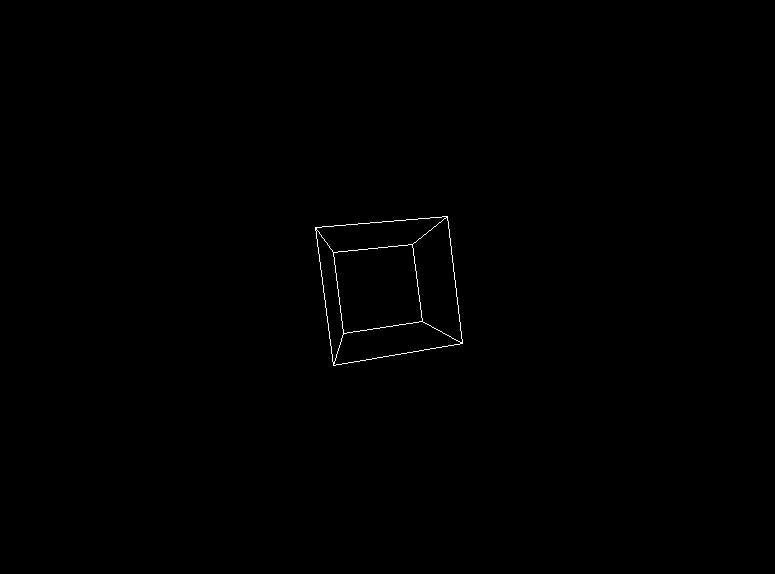

### What a rotating cube is ?
It is a set of vertices (x,y,z) that are equal distance from each other and are connected by a set of edges, in a windows, that renders 3d into 2d by projection and then spins the cube vertices proportionally using rotation matrices

### Project desing, understanding

The main goal of the project is to use linear algebra concepts to create a rotating 3D cube. This means we'll be using concepts like:
- **Vertices**: The points in 3D space that make up the cube.
- **Edges**: The lines that connect 3D points in space.
- **Matrices**: To rotate and transform the cube.
- **Transformation**: Using rotation matrices to manipulate the cube.
- **Rendering**: Projecting the 3D world onto a 2D screen, using the SDL3 GPU for rendering.

### Strategy

1) Setup SDL3 Environment

- Initialize SDL with SDL_Init(SDL_INIT_VIDEO).
- Create a window using SDL_CreateWindow().
- Create a renderer using SDL_CreateRenderer().

2) Define 3D Cube Structure

- Define the 8 vertices of a cube in 3D space using a Vec3 struct.
- Define the 12 edges by connecting pairs of vertices.
- Store the original (unchanging) cube separately to avoid distortion.

3) Implement 3D Rotation
   
- Use rotation matrices to rotate the cube around the X and Y axes.
- Apply transformations proportionally using trigonometric functions:
- X-axis rotation: 
newY = y * cos(angleX) - z * sin(angleX);
newZ = y * sin(angleX) + z * cos(angleX);
- Y-axis rotation: 
newX = x * cos(angleY) + z * sin(angleY);
newZ = -x * sin(angleY) + z * cos(angleY); 
Ensure each frame copies original points to prevent unwanted accumulation of transformations.

4) Project 3D to 2D

- Use a perspective projection formula to convert 3D coordinates into 2D screen coordinates: 
x' = (x / (z + distance)) * scale; 
y' = (y / (z + distance)) * scale;
Adjust distance for depth effect and scale for size control.

5) Render the Cube

- Convert 3D points to SDL points.
- Use SDL_RenderLine() to draw edges between projected points.
- Clear and update the renderer every frame to create smooth animation.

6) Main Loop & Animation

- Use an event loop to keep the program running.
- Continuously increase rotation angles over time.
- Add a delay (16ms) for a stable frame rate (~60 FPS).

7) Cleanup SDL Resources

- Properly destroy the renderer and window before exiting.
- Call SDL_Quit() to free SDL resources.

### Log

11/02/25 - 
Window	Create a window for display
Renderer	Create a renderer for drawing
Main Loop	Keeps the program running, handles input
Render	Clears and draws objects on the screen
Update	Changes object properties for animations
Clean	Free resources and exit

12/02/25 -  
Cube vertices have to be from (-1 -1 -1) to (1 1 1) i.e 0.5 of a cube shall occupy each quadrant, 
the center would be (0 0 0), in the case of (0 0 0) to (1 1 1), the center is going to be at (0.5 0.5 0.5)

15/02/25 -  
Used cartesian product to multiply to sets and get the coordinates for the cube vertices, A {-1,1} x B{(-1,-1),(1,1),(-1,1),(1,-1)}
For loop to iterate thru vertices 

22/02/25 - 
Rendered the lines that connect each vertex
for example (-1 -1 -1) is left bottom corner or 0 row if though in array structure it connects to (-1 1 -1) left top corner

27/02/25 -  
rotation around x axis tilt forward backward, x remains the same
y' = y cos - z sin
z' = y sin  + z cos
rotation around y axis left right, y remains the same 
x' = x cos + z sin
z' = -x sin + z cos 
rotation around z axis, spin in place, z remains the same
x' = x cos - y sin
y' = x sin + y cos 
I want to rotate both, x, y sequencially 

#### bugfixes
27/02/25 -  
cube was accelerating and because of that warping 
fix -  
I was using the same points over and over again, I created an originalPoints and copied the originalPoints into points before rotating 

